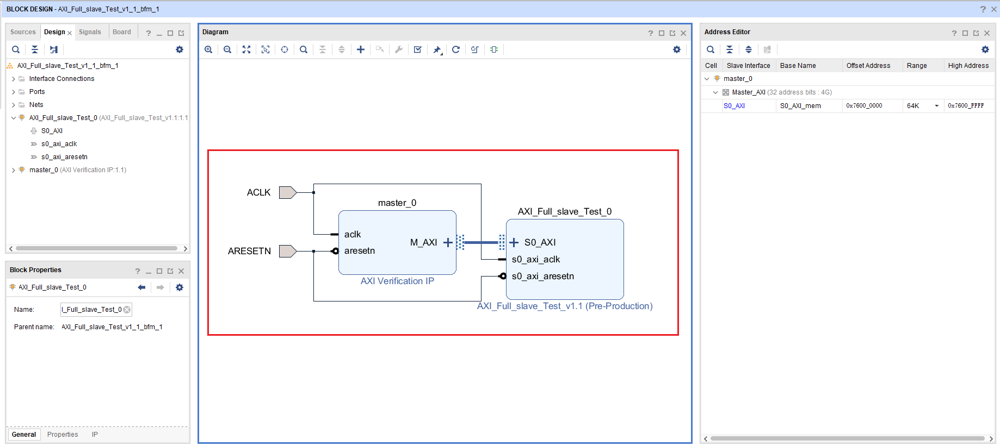
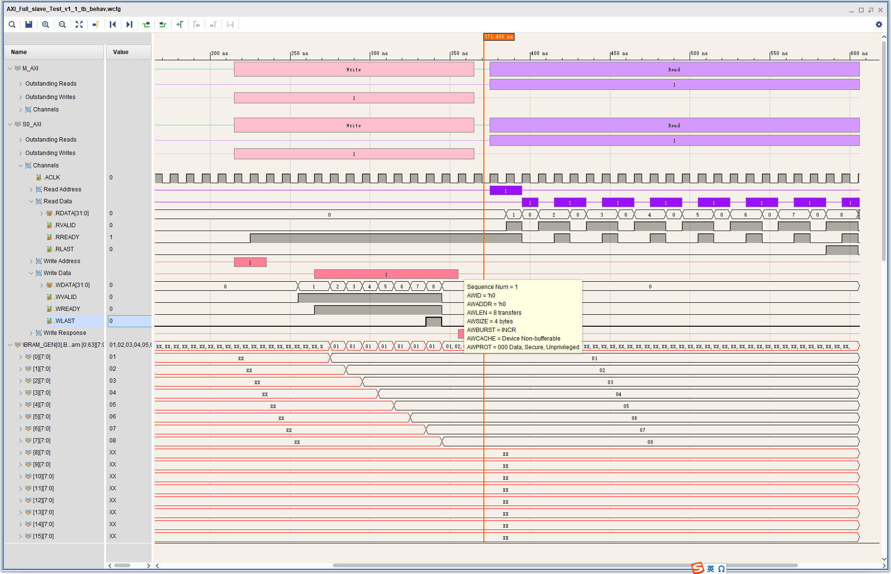
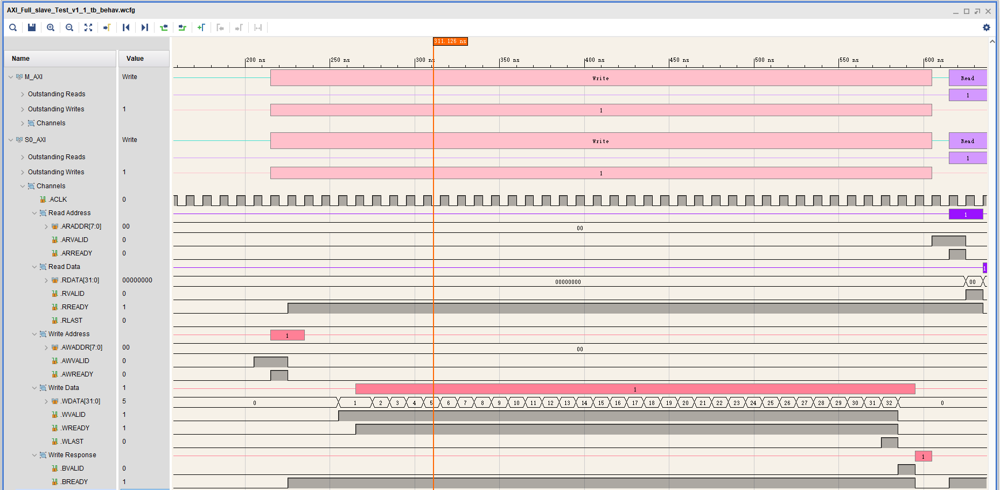
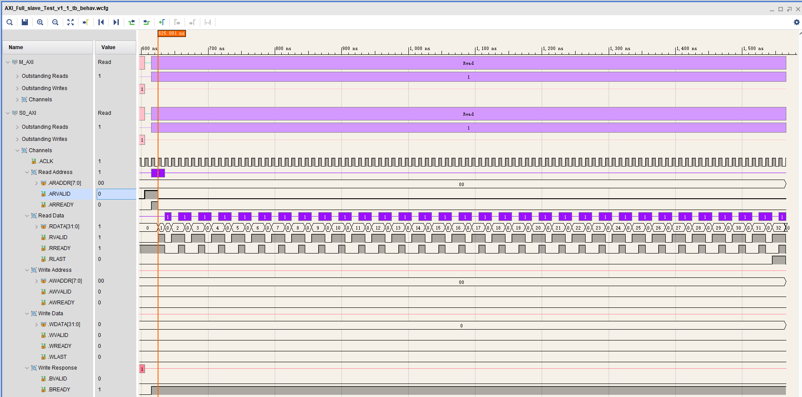
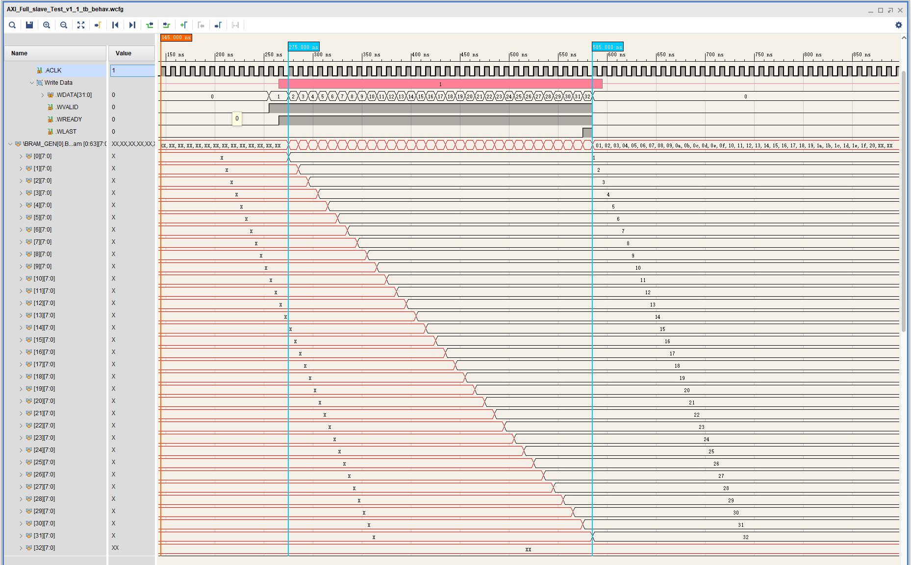

# 创建带AXI-Full从接口的IP并仿真

## 创建 


## 仿真

该示例工程的是基于Xilinx AXI VIP搭建的，其框图如下



该工程自带有用于仿真的`tb`文件，启动仿真后，我们添加如下信号进行观察，



可见，该自动构建的仿真例程做了下面的事情：

- 主机发起了1次突发写事务，突发的长度(握手次数)=8，每次握手传递的字节数=4
- 主机发起了1次突发读事务，突发的长度(握手次数)=8，每次握手传递的字节数=4

接下来我们尝试对其`tb`文件进行修改，包括：

- 主机发起了1次突发写事务，突发的长度(握手次数)=32，每次握手传递的字节数=4
- 主机发起了1次突发读事务，突发的长度(握手次数)=32，每次握手传递的字节数=4

```verilog
`timescale 1ns / 1ps
`include "AXI_Full_slave_Test_v1_1_tb_include.svh"

import axi_vip_pkg::*;
import AXI_Full_slave_Test_v1_1_bfm_1_master_0_0_pkg::*;

module AXI_Full_slave_Test_v1_1_tb();


xil_axi_uint                            error_cnt = 0;
xil_axi_uint                            comparison_cnt = 0;
axi_transaction                         wr_transaction;   
axi_transaction                         rd_transaction;   
axi_monitor_transaction                 mst_monitor_transaction;  
axi_monitor_transaction                 master_moniter_transaction_queue[$];  
xil_axi_uint                            master_moniter_transaction_queue_size =0;  
axi_monitor_transaction                 mst_scb_transaction;  
axi_monitor_transaction                 passthrough_monitor_transaction;  
axi_monitor_transaction                 passthrough_master_moniter_transaction_queue[$];  
xil_axi_uint                            passthrough_master_moniter_transaction_queue_size =0;  
axi_monitor_transaction                 passthrough_mst_scb_transaction;  
axi_monitor_transaction                 passthrough_slave_moniter_transaction_queue[$];  
xil_axi_uint                            passthrough_slave_moniter_transaction_queue_size =0;  
axi_monitor_transaction                 passthrough_slv_scb_transaction;  
axi_monitor_transaction                 slv_monitor_transaction;  
axi_monitor_transaction                 slave_moniter_transaction_queue[$];  
xil_axi_uint                            slave_moniter_transaction_queue_size =0;  
axi_monitor_transaction                 slv_scb_transaction;  
xil_axi_uint                           mst_agent_verbosity = 0;  
xil_axi_uint                           slv_agent_verbosity = 0;  
xil_axi_uint                           passthrough_agent_verbosity = 0;  
bit                                     clock;
bit                                     reset;
integer result_slave;  
bit [31:0] S00_AXI_test_data[3:0]; 
 localparam LC_AXI_BURST_LENGTH = 8; 
 localparam LC_AXI_DATA_WIDTH = 32; 
task automatic COMPARE_DATA; 
  input [(LC_AXI_BURST_LENGTH * LC_AXI_DATA_WIDTH)-1:0]expected; 
  input [(LC_AXI_BURST_LENGTH * LC_AXI_DATA_WIDTH)-1:0]actual; 
  begin 
    if (expected === 'hx || actual === 'hx) begin 
      $display("TESTBENCH ERROR! COMPARE_DATA cannot be performed with an expected or actual vector that is all 'x'!"); 
 result_slave = 0;    $stop; 
  end 
  if (actual != expected) begin 
    $display("TESTBENCH ERROR! Data expected is not equal to actual.",     " expected = 0x%h",expected,     " actual   = 0x%h",actual); 
    result_slave = 0; 
    $stop; 
  end 
  else  
    begin 
     $display("TESTBENCH Passed! Data expected is equal to actual.", 
              " expected = 0x%h",expected,               " actual   = 0x%h",actual); 
    end 
  end 
endtask 
integer                                 i; 
integer                                 j;  
xil_axi_uint                            trans_cnt_before_switch = 48;  
xil_axi_uint                            passthrough_cmd_switch_cnt = 0;  
event                                   passthrough_mastermode_start_event;  
event                                   passthrough_mastermode_end_event;  
event                                   passthrough_slavemode_end_event;  
xil_axi_uint                            mtestID;  
xil_axi_ulong                           mtestADDR;  
xil_axi_len_t                           mtestBurstLength;  
xil_axi_size_t                          mtestDataSize;   
xil_axi_burst_t                         mtestBurstType;   
xil_axi_lock_t                          mtestLOCK;  
xil_axi_cache_t                         mtestCacheType = 0;  
xil_axi_prot_t                          mtestProtectionType = 3'b000;  
xil_axi_region_t                        mtestRegion = 4'b000;  
xil_axi_qos_t                           mtestQOS = 4'b000;  
xil_axi_data_beat                       dbeat;  
xil_axi_data_beat [255:0]               mtestWUSER;   
xil_axi_data_beat                       mtestAWUSER = 'h0;  
xil_axi_data_beat                       mtestARUSER = 0;  
xil_axi_data_beat [255:0]               mtestRUSER;      
xil_axi_uint                            mtestBUSER = 0;  
xil_axi_resp_t                          mtestBresp;  
xil_axi_resp_t[255:0]                   mtestRresp;  
bit [32767:0]                           mtestWDataF;//ms  
bit [32767:0]                           mtestRDataF;//ms  
axi_transaction                         pss_wr_transaction;   
axi_transaction                         pss_rd_transaction;   
axi_transaction                         reactive_transaction;   
axi_transaction                         rd_payload_transaction;  
axi_transaction                         wr_rand;  
axi_transaction                         rd_rand;  
axi_transaction                         wr_reactive;  
axi_transaction                         rd_reactive;  
axi_transaction                         wr_reactive2;   
axi_transaction                         rd_reactive2;  
axi_ready_gen                           bready_gen;  
axi_ready_gen                           rready_gen;  
axi_ready_gen                           awready_gen;  
axi_ready_gen                           wready_gen;  
axi_ready_gen                           arready_gen;  
axi_ready_gen                           bready_gen2;  
axi_ready_gen                           rready_gen2;  
axi_ready_gen                           awready_gen2;  
axi_ready_gen                           wready_gen2;  
axi_ready_gen                           arready_gen2;  
xil_axi_payload_byte                    data_mem[xil_axi_ulong];  
AXI_Full_slave_Test_v1_1_bfm_1_master_0_0_mst_t          mst_agent_0;

  `BD_WRAPPER DUT(
      .ARESETN(reset), 
      .ACLK(clock) 
    ); 
  
initial begin
     mst_agent_0 = new("master vip agent",DUT.`BD_INST_NAME.master_0.inst.IF);//ms  
   mst_agent_0.vif_proxy.set_dummy_drive_type(XIL_AXI_VIF_DRIVE_NONE); 
   mst_agent_0.set_agent_tag("Master VIP"); 
   mst_agent_0.set_verbosity(mst_agent_verbosity); 
   mst_agent_0.start_master(); 
     $timeformat (-12, 1, " ps", 1);
  end
  initial begin
    reset <= 1'b0;
    #200ns;
    reset <= 1'b1;
    repeat (5) @(negedge clock); 
  end
  always #5 clock <= ~clock;
  initial begin
      S_AXI_TEST ();

      #1ns;
      $finish;
  end
task automatic S_AXI_TEST;  
begin   
#1; 
   for(int i = 0; i < 32; i++) begin 
     mtestWDataF[i*32+:32] = i+1; 
   end 
   $display("Sequential write transfers example similar to  AXI BFM WRITE_BURST method starts"); 
   mtestID = 0; 
   mtestADDR = 0; 
   mtestBurstLength = 31; 
   mtestDataSize = xil_axi_size_t'(xil_clog2(32/8)); 
   mtestBurstType = XIL_AXI_BURST_TYPE_INCR;  
   mtestLOCK = XIL_AXI_ALOCK_NOLOCK;  
   mtestCacheType = 0;  
   mtestProtectionType = 0;  
   mtestRegion = 0; 
   mtestQOS = 0; 
   result_slave = 1; 
   for(int i = 0; i < 256;i++) begin 
     mtestWUSER = 'h0; 
   end  
   mst_agent_0.AXI4_WRITE_BURST( 
       mtestID, 
       mtestADDR, 
       mtestBurstLength, 
       mtestDataSize, 
       mtestBurstType, 
       mtestLOCK, 
       mtestCacheType, 
       mtestProtectionType, 
       mtestRegion, 
       mtestQOS, 
       mtestAWUSER, 
       mtestWDataF, 
       mtestWUSER, 
       mtestBresp 
     );   
     $display("Sequential write transfers example similar to  AXI BFM WRITE_BURST method completes"); 
     $display("Sequential read transfers example similar to  AXI BFM READ_BURST method starts"); 
     mtestID = 0; 
     mtestADDR = 0; 
     mtestBurstLength = 31; 
     mtestDataSize = xil_axi_size_t'(xil_clog2(32/8)); 
     mtestBurstType = XIL_AXI_BURST_TYPE_INCR;  
     mtestLOCK = XIL_AXI_ALOCK_NOLOCK;  
     mtestCacheType = 0;  
     mtestProtectionType = 0;  
     mtestRegion = 0; 
     mtestQOS = 0; 
     mst_agent_0.AXI4_READ_BURST ( 
       mtestID, 
       mtestADDR, 
       mtestBurstLength, 
       mtestDataSize, 
       mtestBurstType, 
       mtestLOCK, 
       mtestCacheType, 
       mtestProtectionType, 
       mtestRegion, 
       mtestQOS, 
       mtestARUSER, 
       mtestRDataF, 
       mtestRresp, 
       mtestRUSER 
       ); 
     $display("Sequential read transfers example similar to  AXI BFM READ_BURST method completes"); 
     COMPARE_DATA(mtestWDataF,mtestRDataF); 
     $display("Sequential read transfers example similar to  AXI VIP READ_BURST method completes"); 
     $display("---------------------------------------------------------"); 
     $display("EXAMPLE TEST S0_AXI: PTGEN_TEST_FINISHED!"); 
     if ( result_slave ) begin                    
       $display("PTGEN_TEST: PASSED!");                  
     end    else begin                                       
       $display("PTGEN_TEST: FAILED!");                  
     end                                
     $display("---------------------------------------------------------"); 
  end 
endtask  

endmodule
```





